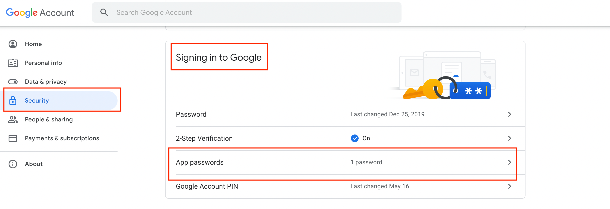

# Maji-Safi
A project to offer safe drinking water

## Cloning the repository
Clone the repository using the command below:

```bash
git clone https://github.com/WayneMusungu/Maji-Safi.git
```

Move into the directory where we have the project files:

```bash
cd Maji-Safi
```

## Create Your `.env` File
Create your `.env` file and pass in the environment variables like in the sample below. Check the `.env-sample` file:

```bash
SECRET_KEY = env('SECRET_KEY', default="secret_key")
DEBUG=True # Set to False when deploying to production

# Email Configuration
EMAIL_BACKEND=your_default_email_backend
EMAIL_HOST=your_default_email_host
EMAIL_PORT=587  # Example default port
EMAIL_USE_TLS=True
EMAIL_HOST_USER=your_default_email_user
EMAIL_HOST_PASSWORD=your_default_email_password
DEFAULT_FROM_EMAIL=your_default_from_email

# Paypal Configuration
PAYPAL_CLIENT_ID=your_pay_pal_client_id

# Google Configuration
GOOGLE_API_KEY=your_default_google_api_key
```

## Set Up Host Gmail Account
- Go to [Security](https://myaccount.google.com/security)

- Scroll till you find **Signing in to Google**

    - In that section, you will see the "App Passwords" option.

    

    - Click **App Passwords**, enter your Gmail account password, and follow the steps as shown:

    

- Following the above steps will allow you to send mail from your Gmail account using your Django code.

## Install Docker
First, sign up for a free account on [Docker Hub](https://hub.docker.com/signup) and install Docker by following the [installation link](https://docs.docker.com/get-docker/).

To verify the correct installation of Docker, run the following command:

```bash
docker --version
```

### Building a Docker Image for the Application
To build an optimized Docker image of the app, run the following command from the root folder where the `Dockerfile` is located:

```bash
docker compose build
docker compose up -d
```

## Setting Up Media Files
The `media` folder, where uploaded images are stored, is ignored by Git. This means you need to manually create it locally when running the app. Here’s how to do that:

1. **Create the `media` folder in the project root:**
   ```bash
   mkdir media
   ```

2. **Set folder permissions:**
   The following commands set the necessary permissions so that the Django app can save media files:

   ```bash
   sudo chmod -R 777 media
   sudo chown -R $USER:$USER media
   ```

   - `sudo chmod -R 777 media`: This gives read, write, and execute permissions to everyone for the `media` folder.
   - `sudo chown -R $USER:$USER media`: This changes the owner of the `media` folder to the current user.

3. **Why do this?**
   - `mkdir media`: This creates the directory that will store uploaded media files.
   - `chmod -R 777 media`: Ensures that all users can read, write, and execute in the `media` folder.
   - `chown -R $USER:$USER media`: Makes sure that the current user has ownership of the directory.

These steps are necessary because the `media` folder is not stored in the repository but is required for file uploads when running the app locally.

### SuperUser Creation
Create a superuser using the command below:

```bash
docker exec -it my-app-container python manage.py createsuperuser
```

### View Application
Once the application is running, you can access the development server at:

> ⚠  http://localhost:8000/